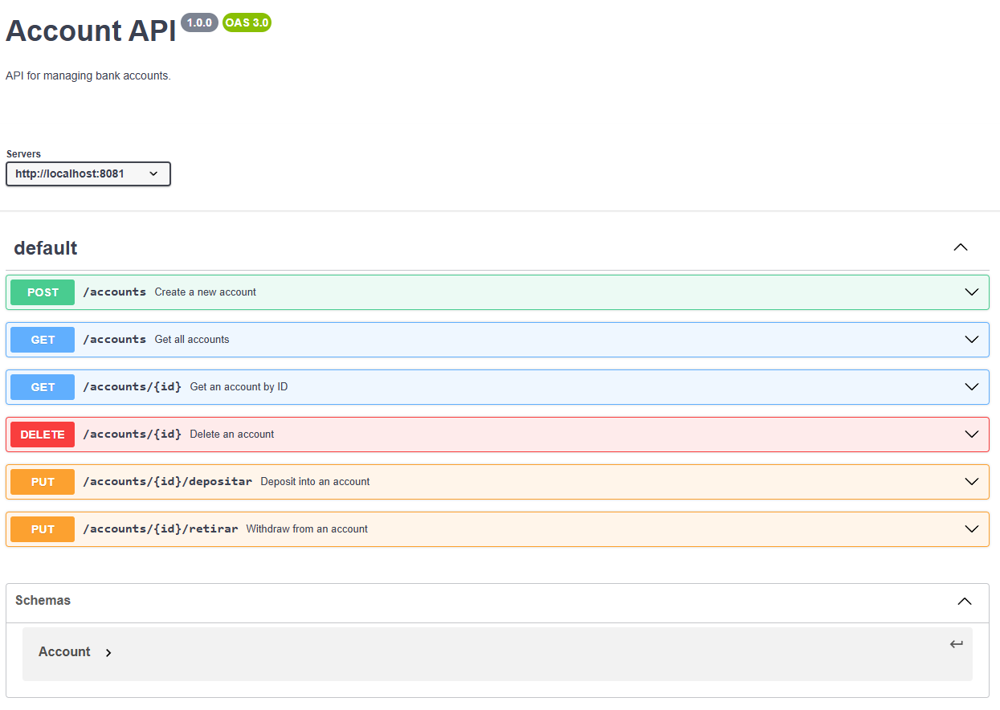
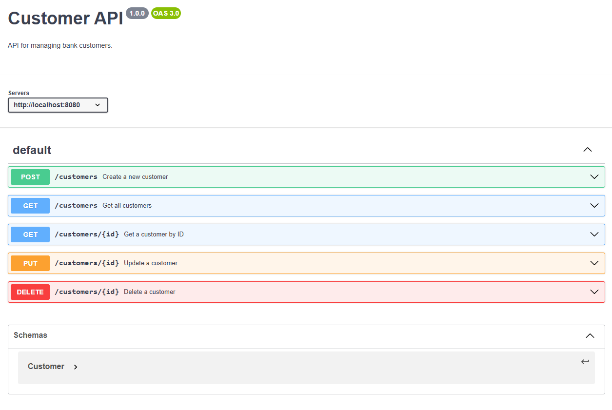

# 🚀 Bank System - Proyecto Bootcamp Java


---

## ✨ Entregable 2
Sistema bancario para el banco **XYZ** que permite gestionar **clientes y cuentas bancarias**, incluyendo **depósitos y retiros**.  
El proyecto está dividido en **microservicios independientes** que se comunican entre sí y se documenta con **OpenAPI**.  

Parte del **Bootcamp Tech Girls Power - Proyecto II**.  

---


---

## ⚙️ Tecnologías
- ☕ Java 17  
- 🗄️ MySQL  
- 🌱 Spring Boot  
- 📜 Spring Data JPA (Hibernate)  
- 📡 OpenAPI (Contract First)  
- 🏗️ Microservicios (OpenFeing, CustomerMs y AccountMs)  
- 🛠️ Maven  
- 💻 IntelliJ IDEA / STS  

---

## 📂 Estructura del Proyecto
## Account-MS



```bash
bank-sys/account-ms
│── src/
│   ├── main/java/com/xyz/bank/account_ms
│   │    ├── controller/
│   │    ├── entity/
│   │    ├── mapper/
│   │    ├── model/
│   │    ├── repository/
│   │    ├── service/
│   │    ├──── impl/
│   ├── resources/
│   │    ├── account-api-yaml (Contrato)
│── pom.xml
│── README.md
```

## Customer-MS



```bash
bank-sys/customer-ms
│── src/
│   ├── main/java/com/xyz/bank/customer_ms
│   │    ├── controller/
│   │    ├── entity/
│   │    ├── mapper/
│   │    ├── model/
│   │    ├── repository/
│   │    ├── service/
│   │    ├──── impl/
│   ├── resources/
│   │    ├── customer-api-yaml (Contrato)
│── pom.xml
│── README.md
